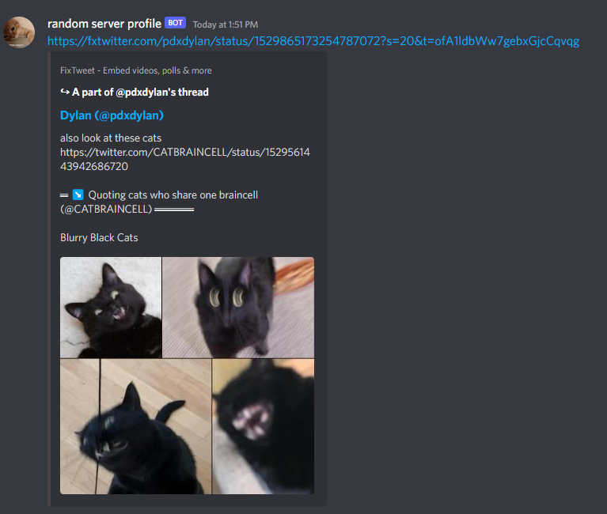

# FxTwitter and ddInstagram discord bot 


A discord bot that converts twitter links to fxtwitter links and instagram links to ddinstagram links. Fxtwitter links provides better embeds than default twitter embeds. DdInstagram links provide better embed than default instagram embeds. No commands required, just add to server and use. It deletes your message and uses webhooks to copy your display name and avatar in a server and sends it with those attached to the webhook (refer to example). You can also remove mentions you don't want the bot to use, translate tweets, toggle link conversion for tweets with different media types and toggle conversion to direct media links through slash commands (check the changelog channel in the support server for more information).

Learn more about fxtwitter here : https://github.com/dangeredwolf/FixTweet

Learn more about ddinstargam here : https://github.com/Wikidepia/InstaFix

Invite link: https://discord.com/api/oauth2/authorize?client_id=1015497909925580830&permissions=412854217728&scope=bot

Invite link to support server: https://discord.gg/6Cza4rW3y9

Example:




You can use this for your projects. 

**You will need a JSON file in your root directory named Config with your bot access token in a "TOKEN" key and your application ID in a "Client ID" key.**

Example

```
{
    "TOKEN": "token here",
    "Client ID": "application id here"
}
```

Discord bot token can be found here : https://discord.com/developers/applications/

Go in the bot section of your application and get your token there. Make sure to **save your token in a secure place** in case you want to access it later as it is only shown once. The application ID is in the general information section of your application.

For inquiries contact : Riko#4020 on discord.
